# Developer Guide

## Acknowledgements

This project was built from scratch by the UniTasker team. The following third-party libraries and references were consulted during development:
- Java SE 17 Standard Library
- JUnit 5
- PlantUML
- SE-EDU AddressBook-Level3

## Design

This section describes the design and implementation of the key components of UniTasker. UML diagrams are provided for highlighted classes and interaction flows

### Architecture

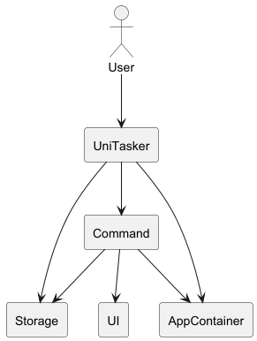

The **Architecture Diagram** given above explains the high-level design of the App

**Main components of the architecture**

UniTasker is in charge of the app launch and shut down
- At app launch, it initializes the other components and repeatedly waits for user inputs.
- At shut down, it shuts down the other components.

The bulk of the app's work is done by the following components:
- Command: Responsible for executing user instructions correctly
- UI: Responsible for displaying messages to the user.
- AppContainer: Acts as a central container for sharing application data.
- Storage: Responsible for saving and loading data from local files.

**How the architecture components interact with each other:**

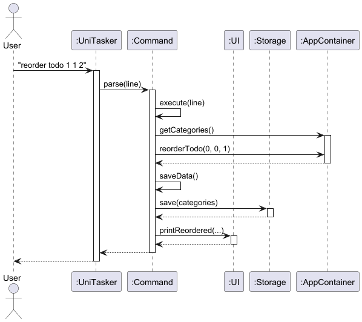

1. User enters command in terminal
2. UniTasker reads the input and passes it to CommandParser
3. CommandParser identifies the command type and creates a corresponding Command object
4. The Command object calls its execute() method with the AppContainer instance
5. The Command modifies the appropriate data structures within AppContainer (categories, tasks, calendar)
6. The Command calls Storage to persist changes to disk
7. UI components display the result of the operation to the user

**AppContainer component**

The `AppContainer` consists of the following:

- `CategoryList categories` – stores all categories and their associated tasks (todos, deadlines, events)
- `Calendar calendar` – Manages the mapping of dates to tasks with date information (deadlines and events)
- `Storage storage` – handles saving and loading of data from local files
- `CourseParser courseParser` – processes and handles course-related commands

The `AppContainer` component,
- Stores all the information required for the application in a single object
- Is passed as an object reference to commands during execution, 
enabling access to shared application data and services without relying on global variables

**Storage component**

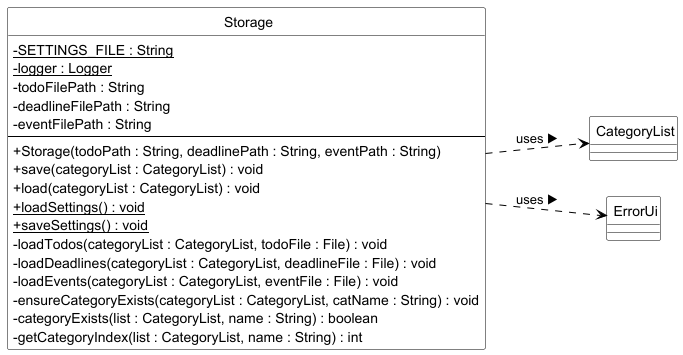

The `Storage` component consists of the following:
- `String todoFilePath` - path to the local file storing todo tasks
- `String deadlineFilePath` - path to the  local file storing deadline tasks
- `String eventFilePath` - path to the local file storing event tasks
- `String SETTINGS_FILE` - path to the file storing application settings (daily task limit, end year)

The `Storage` component,
- Serializes  and persists the current state of CategoryList to disk across three separate files (todos, deadlines, events)
- Deserializes and reconstructs the CategoryList on startup by reading from those files, skipping malformed lines gracefully 
- Loads and saves application-level settings (e.g. daily task limit, calendar end year) independently of task data

**UI component**

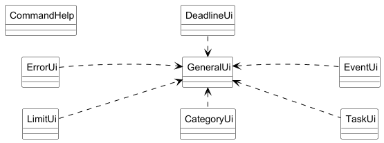

The UI package consists of the following classes:

- `GeneralUi` – central utility class providing shared print helpers (bordered output, welcome screen, reminders) used by all other UI classes
- `ErrorUi` – handles all error and warning messages shown to the user
- `CategoryUi` – handles output for category-related actions (add, delete, list)
- `DeadlineUi` – handles output for deadline-related actions (add, delete)
- `EventUi` – handles output for event-related actions (add, delete, recurring events)
- `TaskUi` – handles output for todo-related actions (mark, priority, sort, reorder, find)
- `LimitUi` – handles output for limit and course result messages
- `CommandHelp` – provides formatted help text for all command modes and topics

The `UI` package,
- Decouples all display logic from business logic by centralizing output into dedicated classes per task type 
- Routes all formatted output through GeneralUi as a single shared rendering layer, ensuring consistent visual formatting across the application

**Command component**

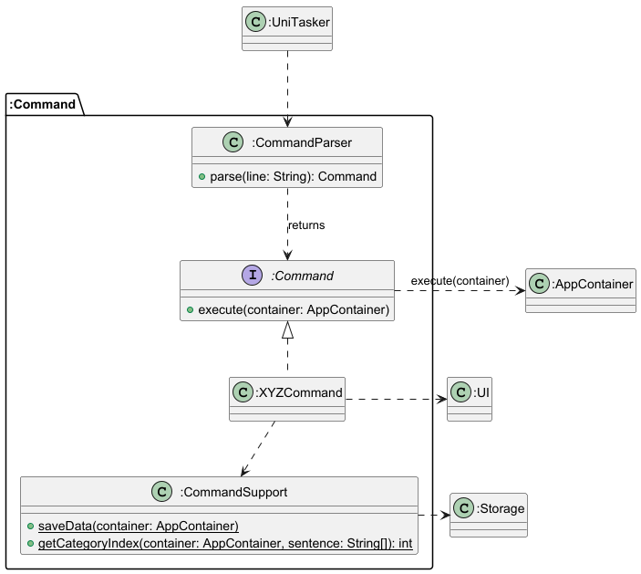

The `Command` component handles the execution of user commands. Each supported command is represented by a separate command class implementing the common `Command` interface.

The component consists of:
- `CommandParser`, which maps raw user input to a concrete command object
- `Command`, which defines the common `execute(AppContainer container)` method
- Concrete command classes such as `AddCommand`, `DeleteCommand`, and so on.
- `CommandSupport`, which provides shared helper methods such as data saving and category index retrieval

**Note:** For most commands, the category index is expected to be at a fixed position (third element) 
in the input array. This design allows the use of a shared helper method in `CommandSupport` to 
consistently extract the category index.

How the `Command` component works:

1. User input is received by `UniTasker`
2. Input is passed to `CommandParser`
3. `CommandParser` returns the appropriate `Command` object
4. `execute(container)` is called
5. Command updates the model via `AppContainer`
6. Changes are saved via `Storage`
7. Output messages are displayed via `UI`

## Implementation

### CategoryList Class Diagram

The figure below illustrates the high-level structure of `CategoryList` within the `AppContainer`.

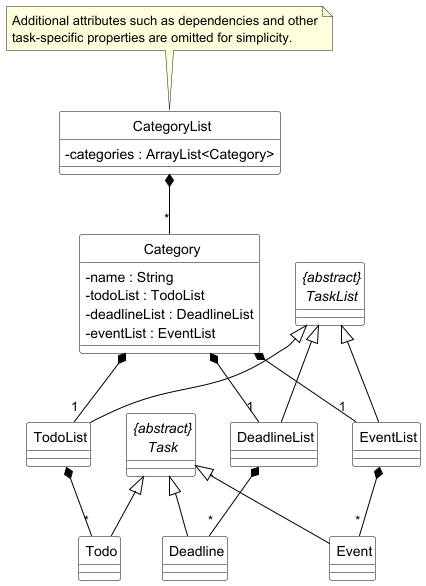

`CategoryList` consists of a collection of `Category` objects. Each `Category` contains three task lists:
- `TodoList`
- `DeadlineList`
- `EventList`

These task lists store their corresponding task types:
- `TodoList` stores `Todo` objects
- `DeadlineList` stores `Deadline` objects
- `EventList` stores `Event` objects

All task types inherit from the abstract `Task` class, while the three task list types inherit from the abstract `TaskList` class.

The `CategoryList` class:
- acts as the central data structure for storing and accessing all categories
- allows unified control over todos, deadlines, and events through their parent categories
- provides methods for category-level operations such as adding, deleting, and reordering categories
- provides methods for task-level operations such as adding, deleting, marking, unmarking, reordering, and setting priorities
- can be accessed via `AppContainer`

This design allows related tasks to be grouped under a category, making it easier for users 
to organize work by module or context. It also improves maintainability by centralizing 
task management logic within `CategoryList` and `Category`.

### Delete Marked Command

The `delete marked` command allows users to remove all completed tasks in a single command.

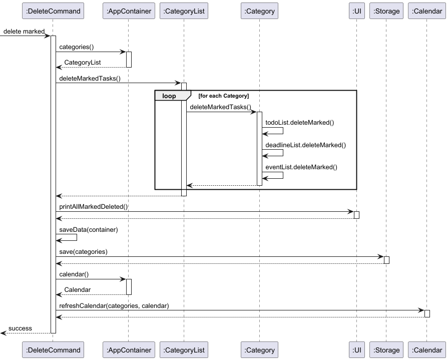

The sequence diagram above shows how the `delete marked` command is handled by `DeleteCommand`.

#### How it works

1. The user enters the `delete marked` command.
2. `DeleteCommand` retrieves the `CategoryList` from the `AppContainer`.
3. `DeleteCommand` calls `deleteMarkedTasks()` on `CategoryList`.
4. `CategoryList` iterates through all `Category` objects it stores.
5. For each `Category`, `deleteMarkedTasks()` is called.
6. Each `Category` then removes marked tasks from all three task lists:
    - `TodoList`
    - `DeadlineList`
    - `EventList`
7. After deletion is complete, a confirmation message is printed through the `UI`.
8. The updated data is saved through `Storage`.
9. The calendar is refreshed to keep it consistent with the updated task data.

#### Design Rationale

This feature demonstrates that `CategoryList` acts as the central access point for all categories and their associated task lists.

By delegating the deletion process through `CategoryList` and `Category`:
- the command layer does not need to access `TodoList`, `DeadlineList`, and `EventList` directly
- task management logic remains encapsulated within the model
- bulk operations can be applied consistently across all task types

This design improves modularity and keeps command logic simple, while allowing `CategoryList` to coordinate operations affecting all three task lists.

### Deadline Class Diagram

The figure below illustrates the relationship between Deadline class and the following classes: Task, Timed, Calendar, DateUtils, DeadlineList, TaskList. 

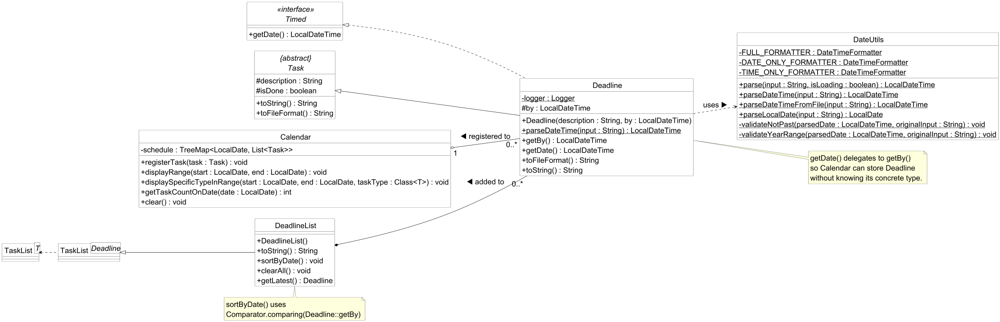

The `Deadline` class consists of the following members:
- `logger` - private logger instance used for fin-grained diagnostic logging on object creation
- `by` stores the due date and time (LocalDateTime) by which the task must be completed
- `Deadline (description, by)` - constructor that initializes the task with a description and deadline, delegating to the parent `Task`
- `parseDateTime(input)` – static helper that delegates to DateUtils to parse a date/time string into a LocalDateTime 
- `getBy()` – returns the raw deadline date/time 
- `getDate()` – satisfies the Timed interface by delegating to getBy(), enabling calendar and sorting integrations
- `toFileFormat()` – serialises the task into pipe-delimited storage format (D, done, description, datetime)
- `toString()` – produces a human-readable representation prefixed with [D]

The `Deadline` class,

- Extends `Task` to inherit description and completion state, adding only the `by` field to keep deadline-specific logic self-contained 
- Implements the `Timed` interface so that `Calendar` can register and sort `Deadline` objects polymorphically without depending on the concrete type 
- Delegates all date parsing to `DateUtils`, ensuring consistent validation and formatting rules are applied uniformly across task types

### Event management
The event commands manages one-time occurrences and automated recurring schedules, utilising a mapping layer to ensure UI actions correctly modify the underlying data.

*Note: The relationship between `Event` class with `EventList`, `Tasked`, `Timed`, `Calendar`, `DateUtils` and `TaskList` classes is similar to the relationship between `Deadline` class and the classes mentioned above under the Deadline Class Diagram section.*
#### Add Event Command

**Workflow for Add Event command**
1. User enters either:
   - `add event <categoryIndex> <description> /from <startDateTime> /to <endDateTime>`
   - `add recurring <categoryIndex> weekly event <description> /from <day> <time> /to <day> <time> /(date or month) <dateOrMonth>`
2. Input is parsed and `AddCommand` is created.
3. `AddCommand` calls `CategoryList` functions to add events.
4. If non-recurring:
   - `EventList` `add(Event)` is called
5. If recurring:
   - `EventList` `addRecurringWeeklyEvent(event, calendar, date, months)` is called to generate and group weekly events.
6. Event(s) are stored in `EventList`, persisted by `Storage`, and reflected in the `Calendar`

**Sequence Diagram for `add event` command**
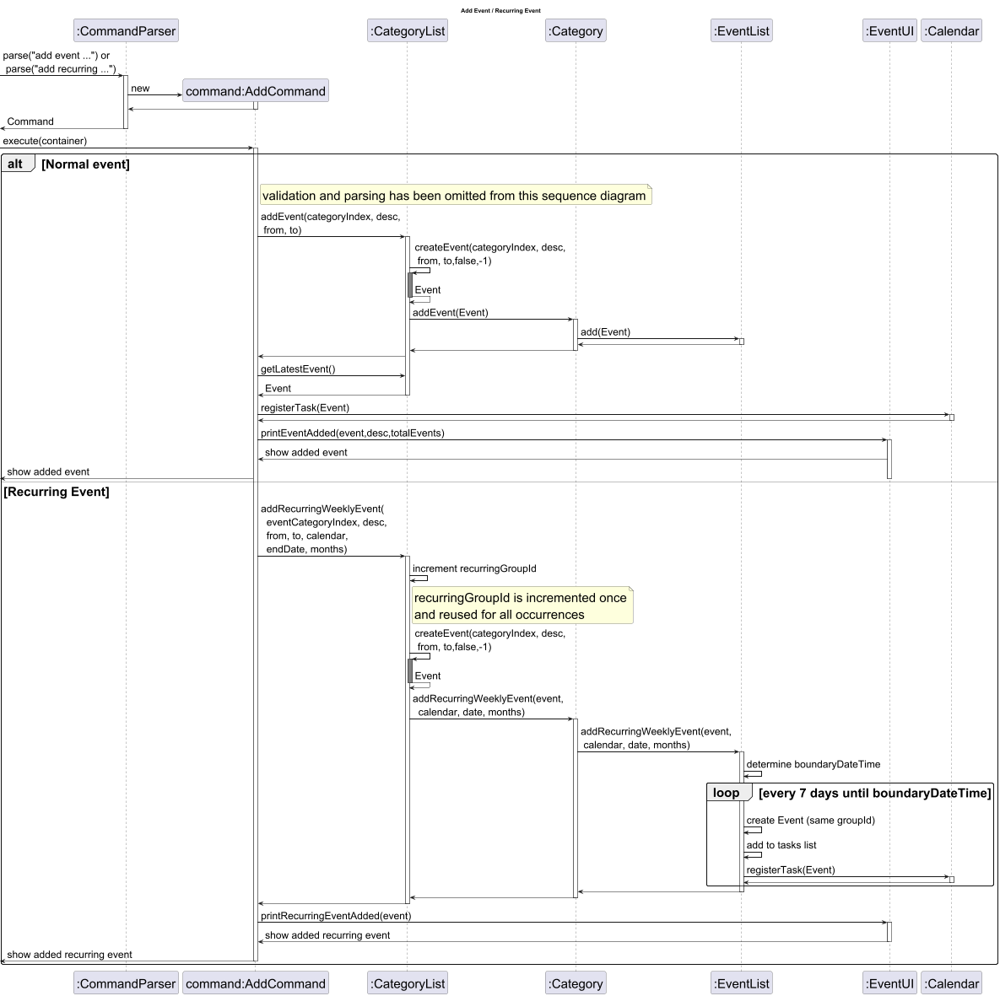

#### List Event Command

**Workflow for List Event command**

The list command is a prerequisite for deletion and modification as it synchronises the user's view with the underlying data coordinates.

1. User enters a command such as `list event`, `list recurring`, or `list event /all`.

2. Input is parsed by the `CommandParser`, which creates a `ListCommand` object.

3. ListCommand calls `CategoryList.getAllEvents(showAll,showNormalEventsOnly)` with flags determining the view (e.g., collapsed vs. expanded).

4. Mapping Generation: As the `CategoryList` iterates through categories and events to build the display string, it simultaneously populates the `activeDisplayMap`.

5. Each displayed line is assigned a UI Index, which is mapped to an `EventReference` containing the (categoryIndex, eventIndex).

6. The formatted string is sent to `GeneralUi` for display, and the `currentView` is updated to allow subsequent delete or edit commands to reference the correct map.

**Sequence Diagram for `list event` command**

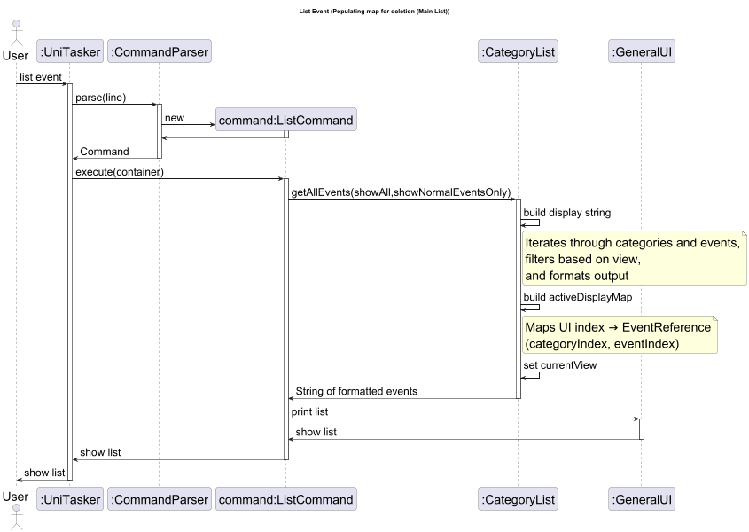

####  Delete Event Command

**Workflow for Delete Event command**

1. User types `delete event <categoryIndex> <uiIndex>` which is parsed by `CommandParser` class to
   create a `DeleteCommand` object
2. In `DeleteCommand` under 'event' uiIndex is parsed and used as an index in the list of `EventReference` objects to
   get the particular `EventReference` object
3. Event is then deleted using `EventReference.categoryIndex` and `EventReference.eventIndex`.
4. Changes are updated in `Storage` class and `Calendar` object

Note:
- `list event` must be called before `delete event <categoryIndex> <uiIndex>` to populate the map correctly
- `delete occurrence <categoryIndex> <uiIndex>` and `delete recurring <categoryIndex> <uiIndex>` works the same
  except for deleting multiple events at once (all events in recurring group) for `delete recurring <categoryIndex> <uiIndex>`

**Sequence Diagram for `delete event <categoryIndex> <uiIndex>` command**

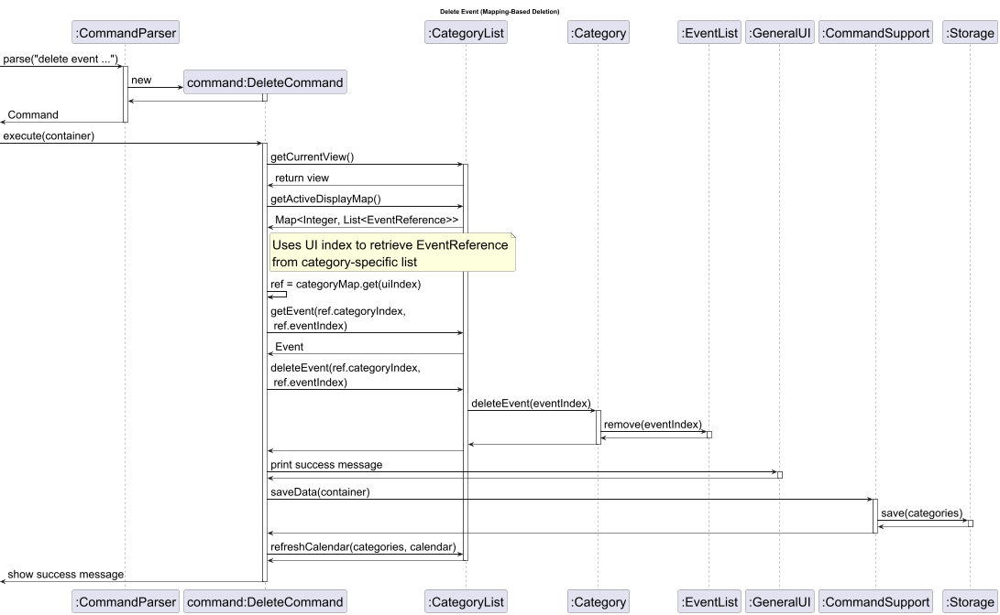

**Key Design Considerations**

The following architectural choices ensure that UniTasker remains efficient, extensible, and user-friendly despite the complexity of time-based data.

**1. UI-to-Data Mapping**

To maintain a clean user interface, UniTasker utilises a translation layer that bridges the gap between the "collapsed" UI view and the detailed data model:

- **`EventReference` Tracking**: Each UI entry is backed by an `EventReference` storing the (categoryIndex, eventIndex). This acts as a direct pointer to the actual data object in the `EventList`
- **`ActiveDisplayMap`**: This `Map<Integer,List<EventReference>>` map (where the key is the category index and the value is a list of `EventReference` objects) is populated during list commands. It ensures that when a user inputs a UI index (e.g., delete event 1 5), the command resolves to the exact physical index in the backend.
-  **Data Integrity**: This mapping allows the system to support complex views such as grouping weekly lectures while ensuring that deletions and modifications target the correct individual data objects.

Example:

    list event /all

| categoryIndex | uiIndex | EventReference (categoryIndex, eventIndex) |   Description   |
|:-------------:|:-------:|:------------------------------------------:|:---------------:|
|       0       |    1    |                   (0,0)                    |  consultation   |
|       0       |    2    |                   (0,1)                    | CS2113 tutorial |
|       0       |    3    |                   (0,2)                    |     meeting     |
|       0       |    4    |                   (0,3)                    | CS2113 lecture  |
|       0       |    5    |                   (0,4)                    | CS2113 tutorial |
|       0       |    6    |                   (0,5)                    | CS2113 lecture  |
|       1       |    1    |                   (1,0)                    |   yoga lesson   |
|       1       |    2    |                   (1,1)                    |   yoga lesson   |

    list event

| categoryIndex | uiIndex | EventReference (categoryIndex, eventIndex) |   Description   |
|:-------------:|:-------:|:------------------------------------------:|:---------------:|
|       0       |    1    |                   (0,0)                    |  consultation   |
|       0       |    2    |                   (0,1)                    | CS2113 tutorial |
|       0       |    3    |                   (0,2)                    |     meeting     |
|       0       |    4    |                   (0,3)                    | CS2113 lecture  |
|       1       |    1    |                   (1,0)                    |   yoga lesson   |

    list recurring

| categoryIndex | uiIndex | EventReference (categoryIndex, eventIndex) |   Description   |
|:-------------:|:-------:|:------------------------------------------:|:---------------:|
|       0       |    1    |                   (0,1)                    | CS2113 tutorial |
|       0       |    2    |                   (0,3)                    | CS2113 lecture  |
|       1       |    1    |                   (1,0)                    |   yoga lesson   |

**2. Polymorphism and Time-Based Tasks**

UniTasker treats deadlines and events differently from todos to enable advanced scheduling features:
- **Inheritance**: A shared interface allows the `Calendar` class to store and query deadlines and events polymorphically. This enables range queries (e.g., "show all tasks this week") without the `Calendar` needing to know the specific task type.
- **Efficient Lookups**: The `Calendar` uses a `TreeMap<LocalDate, List<Task>>`. This structure provides $O(\log n)$ lookup times for specific dates and efficient range-based sub-maps, avoiding the need to iterate through the entire global task list.
- **Formatting Flexibility**: `DateUtils` encapsulates three `DateTimeFormatter` constants, to store deadlines and events in different formats.

**3. System Integrity and Hierarchy**

- **Centralised Hub**: The `CategoryList` acts as a central task management hub, interfacing with multiple specialized task lists (`TodoList`, `DeadlineList`, `EventList`) to maintain separation of concerns
- **Defensive Programming**: Java assertions are used throughout the codebase to validate preconditions and invariants, such as ensuring task descriptions and category names are non-empty
- **Inheritance**: `DeadlineList` and `EventList` extends the generic `TaskList`, inheriting add/delete/mark/contains operations.

### Helper functions: Task Validation ###

There are two main types of validations for task. 

- Time Validation
- Occurrence Validation

The following figures explains how tasks are validated based on Time and Occurrence.

**DateUtils.parse()**

DateUtils is used as a Time Validator. 

The sequence diagram below illustrates how a date string entered by the user is parsed, validated, and return as a LocalDateTime. This flow is triggered whenever a timed task, a deadline or event, is added. Recurring events will be illustrated in a different diagram as it does not follow numerical convention. 

Example: `Add deadline 1 Homework /by 31-12-2025 1800` or `Add event 1 Homework /from 31-12-2025 1800 /to 01-01-2026`

**Note: The command in the diagram has been generalized as a date since DateUtils validates dates only**

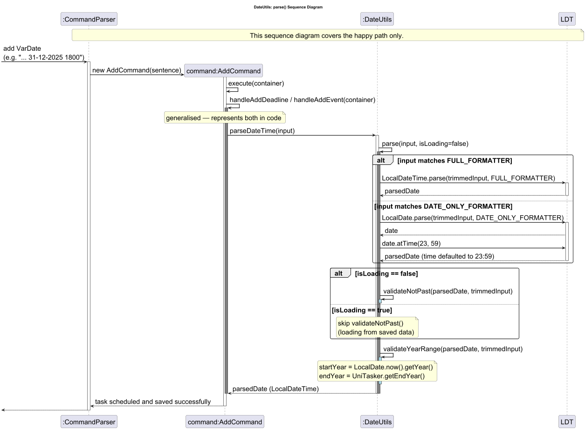

**Parsing Flow Summary:**

- A task is followed by a date string
- CommandParser parse the line and calls AddCommand
- AddCommand then calls for handleAddEvent/handleAddDeadline, depending on whether an event or a deadline is being added.
- As this is a command given from User, the isLoading flag is set to false.
- DateUtils will then check for the following conditions : is input empty or null, is the date parsed following the FULL_FORMATTER or DATE_ONLY FORMATTER
- If only date is parsed, time is automatically set to 2359
- If all the above checks pass and isLoading == false, check if date is in the past
- If all checks pass, the last check would be if the task exist within the stipulated timeframe that user has set/ default timeframe
- If all checks are parsed, the task will be added to its tasklist (DeadlineList or EventList) and registered in the Calendar
- If any of the checks fail along the way, an error message pertaining to the error will be shown to the user

**Implementation Note - isLoading Flag**

The IsLoading parameter is set to true when DateUtils.parse() is called from the storage layer (file loading), and false during user input. This allows tasks saved in a previous session to be restored if their dates have now passed, while preventing the user form directly scheduling past tasks interactively.

**TaskValidator**

TaskValidator ensures that there is a unique occurrence of a given task with no overlaps.

Before any task (Todo, Deadline, Event) is added to the system, the AddCommand invokes three sequential validation passes via TaskValidator. These checks ensure that no Task have the same name, workload per day does not exceed set limit and there is no overlap in events. The diagram below shows the full interaction.

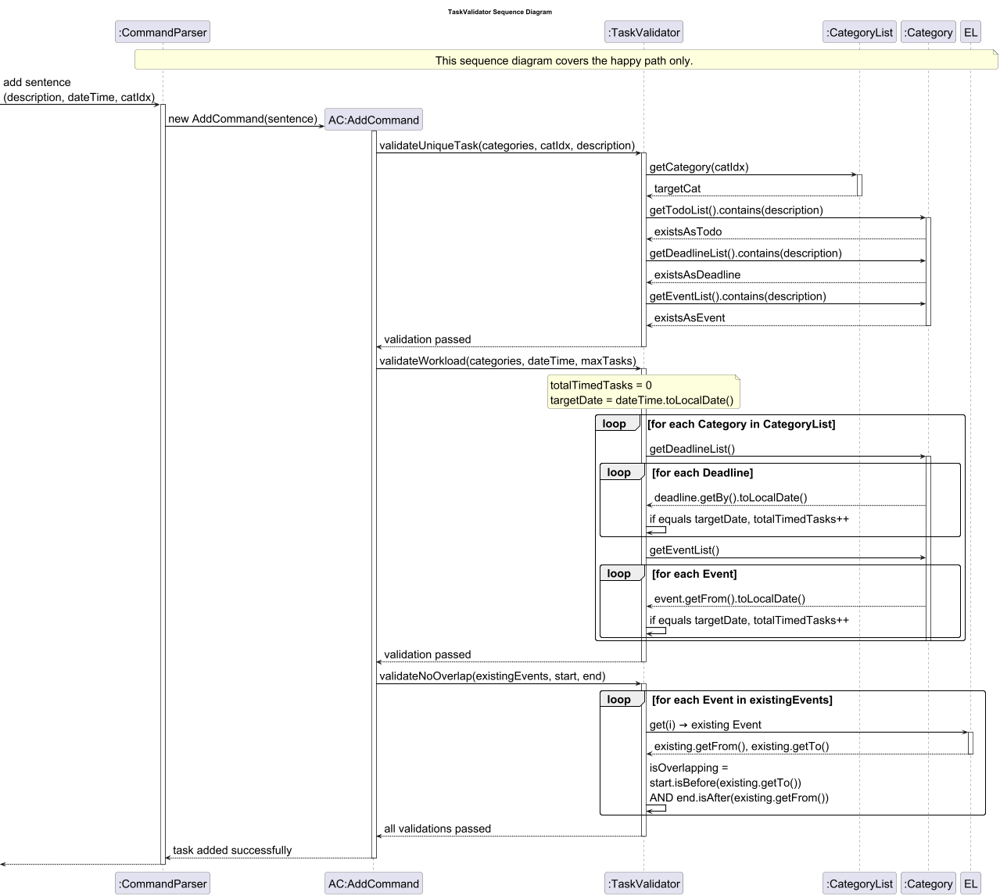

**Parsing Flow Summary**

- add task with its description, date with or without time and category index
- retrieve all tasks from todoList, deadlineList and eventList
- Check for any duplicate names, if no check the number of workload for each day with registered timed task
- If totalTimedTask is greater than or equal to maxTask, throw a HighWorkloadException error
- Otherwise, check for any overlap in timing with existing events
- If yes throw an OverlapEventException, otherwise all validators have been passed and task is added successfully

### Feature: Course Tracker

The Course Tracker feature allows students to manage their courses and track their assessment scores and weightages.

**Course Class Diagram**

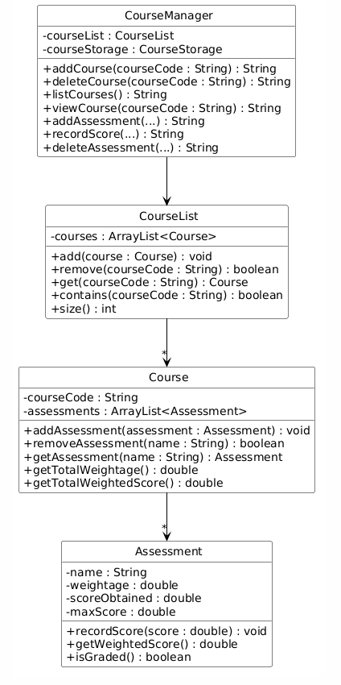

The following sequence diagram shows how a `course add` command is executed:

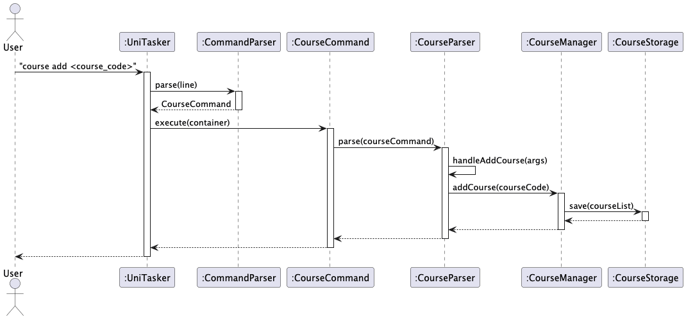

**Key Design Considerations**

- `CourseParser` is kept separate from `CommandParser` to isolate course-specific parsing logic
- `CourseManager` acts as the single point of access for all course operations
- `CourseStorage` is a separate class from the main `Storage` class, handling course data persistence in its own file (`courses.txt`) using a different block-based format
- Weighted score is calculated as: `weightedScore = (scoreObtained / maxScore) * weightage`

---

### Feature: Undo (Course Commands)

The undo feature allows users to reverse the most recent course command that modified data.

The following sequence diagram shows how an `undo` command is executed:

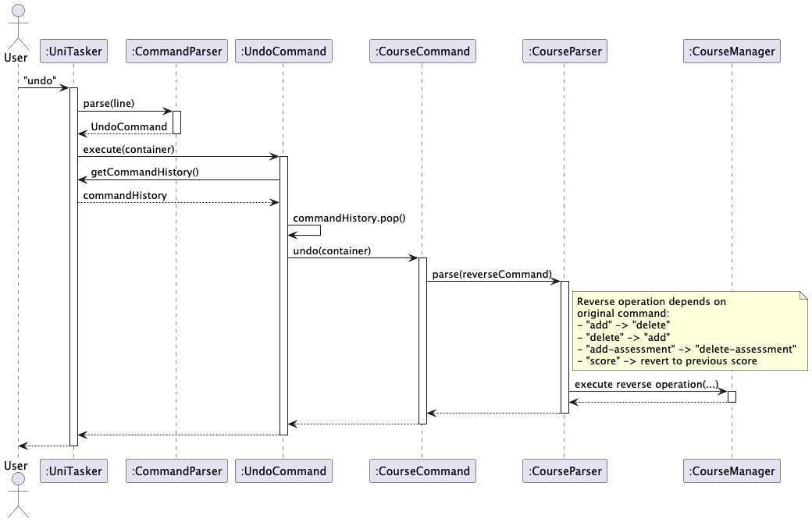

The following class diagram shows the structure of the undo feature:

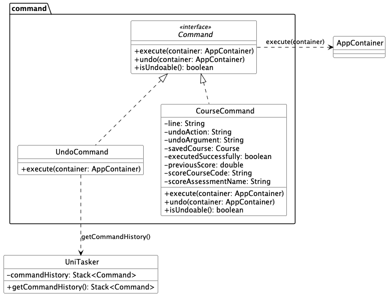

**Key Design Considerations**

- `UniTasker` maintains a `Stack<Command>` to track undoable commands
- `Command` interface exposes default `undo()` and `isUndoable()` methods so existing commands are unaffected
- Only course commands that modify data are pushed to the stack (`add`, `delete`, `add-assessment`)
- Undo history is cleared on app exit

---

## Product scope

### Target user profile

UniTasker is designed for university students who need to manage multiple courses, assignments, deadlines, and personal tasks simultaneously. 
These users often:
- juggle academic responsibilities across different modules, each with varying deadlines, 
priorities, and schedules. 
- require a simple and efficient system to organize their tasks,
keep track of coursework, and stay on top of deadlines.
- prefer a fast, keyboard-driven interface over GUI-heavy applications

### Value proposition

University students often struggle to keep track of tasks and course assessments across different 
platforms such as learning portals, calendars and notes. This fragmented approach leads
to missed deadlines, poor prioritization, and unnecessary stress. 

UniTasker provides a centralized 
task management solution that consolidates todos, deadlines, events and course information into a 
single platform. Through a simple command-line interface, it allows students to efficiently organize, 
update, and review their tasks and assessments. This helps students to stay on top of their workload
and focus on completing their academic responsibilities.

## User Stories

| Version | As a ...           | I want to ...                                                              | So that I can ...                                             |
|---------|--------------------|----------------------------------------------------------------------------|---------------------------------------------------------------|
| v1.0    | University Student | create categories for each of my courses                                   | organise my tasks by module                                   |
| v1.0    | University Student | view a specific category                                                   | focus on tasks related to a single course                     |
| v1.0    | University Student | assign priority levels to todos in a category                              | identify important todos easily                               |
| v1.0    | University Student | sort todos within a category by priority                                   | focus on high-priority todos first                            |
| v1.0    | University Student | track all tasks with a due date                                            | keep track of all my deadlines                                |
| v1.0    | University Student | arrange tasks which occur or are due within a certain time period          | prioritise tasks that are due earlier                         |
| v1.0    | University Student | delete all deadlines within a category                                     | quickly remove deadlines in a category                        | 
| v1.0    | University Student | have my deadlines sorted by earliest date                                  | easily identify earliest due deadline                         |
| v1.0    | University Student | track all tasks with a start date and time and end date and time           | keep track of all my events                                   |
| v1.0    | University Student | have my events sorted by earliest date                                     | easily identify events that happen earliest                   |
| v1.0    | University Student | track all recurring tasks with a start date and time and end date and time | keep track of all my recurring events                         |
| v1.0    | University Student | add a course                                                               | keep track of all the modules I am taking                     | 
| v1.0    | University Student | delete a course                                                            | remove modules I am no longer taking                          |
| v1.0    | University Student | list all courses                                                           | see an overview of all my modules                             |
| v1.0    | University Student | add assessments to a course                                                | track the components that make up the grades                  |
| v1.0    | University Student | delete an assessment from a course                                         | remove an incorrect or irrelevant assessment from the tracker |
| v1.0    | University Student | view all assessments within a course                                       | understand how my course grading is structured                |
| v1.0    | University Student | record my score for an assessment                                          | keep track of my performance in each assessment               |
| v2.0    | University Student | delete all marked tasks                                                    | quickly clean up completed work across categories             |
| v2.0    | University Student | search for tasks across all categories                                     | quickly find relevant tasks                                   |
| v2.0    | University Student | customize the maximum tasks permitted per day                              | schedule my tasks without burning myself out                  |
| v2.0    | University Student | customize the year of my schedule                                          | plan beyond my acedemic years                                 |
| v2.0    | University Student | customise the duration to add a certain recurring event                    | adjust it based on the event                                  |
| v2.0    | University Student | have reminders for events and deadlines coming soon                        | plan my time accordingly to complete them                     |
| v2.0    | University Student | have different views of events                                             | so that it is clearer to distinguish different type of events |
| v2.0    | University Student | undo my last course action                                                 | reverse accidental changes to the course tracker              |

## Non-Functional Requirements

1. Should work on any mainstream OS as long as it has Java `17` or above installed.
2. Should be able to hold up to 500 tasks/courses without a noticeable reduction in performance
3. A user with above average typing speed for regular English text 
can accomplish most of the tasks faster using commands than using the mouse.

## Glossary

* *Mainstream OS* - Windows, Linux, Unix, macOS
* Task - refers to todos, deadlines, events

## Instructions for Manual Testing

### Adding Todos

1. Launch the application.
2. Ensure at least one category exists. If not, create one: `add category School`
3. Add a todo to a category: `add todo 1 finish tutorial`
4. Add a todo with priority: `add todo 1 reply email /p 5`
5. Verify that the todo appears under the School category using: `list category`  

### Testing Course Tracker

1. Launch the application.
2. Add a course: `course add CS2113`
   - Expected: Added Course CS2113
3. Add an assessment: `course add-assessment CS2113 /n Finals /w 40 /ms 100`
   - Expected: Added assessment Finals to CS2113 (weight: 40.0%, max score: 100.0)
4. Record a score: `course score CS2113 /n Finals /s 85`
   - Expected: Recorded score for Finals in CS2113: 85.0/100.0
5. View course: `course view CS2113`
   - Expected:
     Course: CS2113
     Assessments:
   1. Finals (weight: 40.0%, score: 85.0 / 100.0)
   Current weighted score: 34.0%
   Graded weightage: 40.0%
   Total planned weightage: 40.0%
6. Delete a course: `course delete CS2113`
   - Expected: Deleted course: CS2113

### Testing Undo

1. `undo` with no prior course commands
   - Expected: "Nothing to undo."
2. `course add CS2113` then `undo`
   - Expected: Undo: removed course CS2113
3. `course add-assessment CS2113 /n Finals /w 40 /ms 100` then `undo`
   - Expected: Undo: removed assessment Finals
